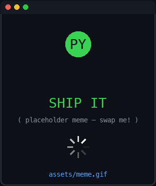

 

<table>
<tr>
<td align="center"></td>
<td align="center"></td>
</tr>
</table>

 

<strong>
<a href="https://github.com/amanchikalapudi">GitHub</a>
&nbsp;·&nbsp;
<a href="https://www.linkedin.com/in/amanchikalapudi/">LinkedIn</a>
&nbsp;·&nbsp;
<a href="mailto:avinash.manchikalapudi93@gmail.com">Email</a>
</strong>

 

# Hi, I'm Avinash 👋

Senior Voice / VoIP & Unified Communications Engineer with 8+ years designing, deploying, and operating enterprise voice infrastructure at 24/7 availability for 10,000+ users — Cisco CUCM, Session Border Controllers, SIP trunking, and cloud voice (Webex Calling, Microsoft Teams Phone Direct Routing).

I work at the intersection of traditional telecom engineering and modern platform automation — bridging Cisco/Ribbon/AudioCodes enterprise voice stacks with Python, Ansible, and open-source SIP tooling.

## 🔭 What I work with

**Voice / UC Platforms:** Cisco CUCM, Unity Connection, UCCX, Expressway, Webex Calling, Microsoft Teams Phone (Direct Routing), Genesys Cloud CX, Amazon Connect (Lex, Lambda, DynamoDB)

**SBC & SIP:** Ribbon, AudioCodes, Cisco CUBE, Oracle SBC, Kamailio, rtpengine, Asterisk

**Protocols:** SIP, RTP, SRTP, WebRTC, STIR/SHAKEN, H.323, MGCP

**Automation & Tooling:** Python, Ansible, PowerShell, Cisco AXL API (SOAP/REST), Docker

**Diagnostics:** Wireshark, tcpdump, RTMT, SolarWinds

## 🧪 Featured project

**[sip-lab-kamailio-rtpengine](https://github.com/amanchikalapudi/sip-lab-kamailio-rtpengine)** — A containerized home lab replicating an access-SBC-in-front-of-core-PBX topology. Kamailio handles SIP proxy/registration, rtpengine anchors RTP media, and Asterisk runs as the softswitch core — all in Docker on a Raspberry Pi 5. Built to get hands-on with the same architectural pattern used by production SBC platforms.

**[cisco-axl-automation](https://github.com/amanchikalapudi/cisco-axl-automation)** — Python and PowerShell scripts against the Cisco AXL API for UC configuration provisioning, reporting, and validation, cutting manual validation effort in production environments.

**[amazon-connect-toolkit](https://github.com/amanchikalapudi/amazon-connect-toolkit)** — Contact flow patterns and Lambda integrations for Amazon Connect, including Lex intent routing, DynamoDB caller lookups, and fallback handling — built from hands-on Connect administration work.

**[genesys-cloud-migration](https://github.com/amanchikalapudi/genesys-cloud-migration)** — Documentation and planning artifacts from leading a full UCCX-to-Genesys Cloud CX migration, covering routing redesign, queue mapping, and IVR/flow migration methodology.

## 📫 Reach me

- LinkedIn: [linkedin.com/in/amanchikalapudi](https://www.linkedin.com/in/amanchikalapudi/)
- Email: avinash.manchikalapudi93@gmail.com

---

The contribution heatmap and info card above are self-hosted SVGs, animated with SMIL (no third-party widgets, no tokens) and refreshed daily by <a href=".github/workflows/update-profile-art.yml">a GitHub Action</a>. Swap <code>assets/meme.gif</code> for your own. See <a href="scripts/">scripts/</a> for how they're generated.
